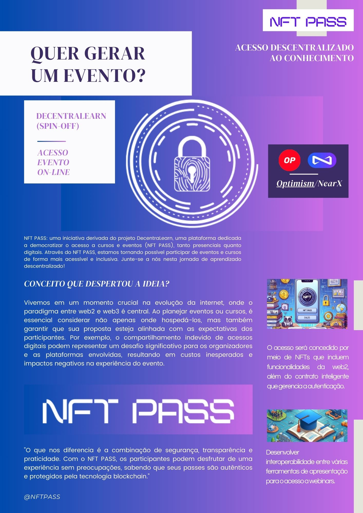

# NFT PASS:Acesso descentralizado ao conhecimento #

O NFT PASS é uma revolucionária ferramenta que permite acesso descentralizado ao conhecimento por meio de NFTs. Oferecendo autenticidade, transparência e interoperabilidade, o NFT PASS redefine a maneira como os eventos online são acessados e compartilhados. 

Com os recursos avançados de personalização e engajamento, os participantes podem desfrutar de experiências únicas e interativas durante os webinars. Além disso, os criadores de conteúdo se beneficiam da facilidade de transferência e revenda dos NFTs, ampliando seu alcance e incentivando o compartilhamento do conhecimento. 

O NFT PASS é uma ferramenta inovadora que visa promover uma educação mais inclusiva, acessível e descentralizada para todos.

## **Benefícios**

1. **Autenticidade e Prova de Propriedade:** Os tickets do NFT PASS oferecem uma solução única e imutável para autenticar a propriedade de acesso a eventos online, garantindo que apenas os legítimos proprietários possam participar.

2. **Transparência e Imutabilidade:** Ao serem registrados em blockchains públicas,  os tickets do NFT PASS garantem total transparência e imutabilidade, permitindo uma verificação fácil e confiável da propriedade do acesso ao evento.

3. **Facilidade de Transferência e Revenda:** A interoperabilidade aprimorada entre várias ferramentas de apresentação facilita a transferência e a revenda dos  tickets do NFT PASS de acesso a eventos online entre os participantes, criando um mercado dinâmico e fluido.

4. **Personalização e Engajamento:** A interoperabilidade entre as ferramentas de apresentação permite uma personalização mais profunda dos tickets do NFT PASS de acesso, oferecendo aos participantes experiências exclusivas e engajadoras durante o evento online.

5. **Incentivos para Criadores de Conteúdo:** Os criadores de conteúdo se beneficiam da interoperabilidade, pois podem integrar facilmente os tickets do NFT PASS de acesso a seus eventos online em diversas plataformas, ampliando assim seu alcance e aumentando sua base de fãs.

[https://www.canva.com/design/DAGASh3UM_0/lDb-RdXqCaARCRHVagFgTg/view?utm_content=DAGASh3UM_0&utm_campaign=designshare&utm_medium=link&utm_source=editor]

-------
----

-----

## Equipe

### Gabriel Thome
Blockchain Developer | Software Engineer | Smart Contracts | Solidity | TypeScript | JavaScript | MERN Full Stack

https://www.linkedin.com/in/gabrieltome/

### Tiago Cavazin
Dev Solidity| Arquiteto em  soluções empresariais Blockchain  Engenheiro em Blockchain | Arquiteto e Designer de Tokenomics|   Product Managment| Pesquisador Web3

https://www.linkedin.com/in/tiagoferreiracavazin/

###  Valter Lobo
Software Engineer | Software Architect | Blockchain Developer | Product Manager | Scrum Master

https://www.linkedin.com/in/valterlobo/

## FLUXO DE FUNCIONAMENTO 

.jpg>)

## Links

### Smarts Contracts 

#### NFTPassFactory 

Realiza a criação dos eventos  (NFTPass) 

https://sepolia-optimism.etherscan.io/address/0x55ada3c97518673b2e9db327f4e2d9d220ec23b1#code

#### NFTPass 

Cada evento e realizado o deploy de novo smartContract NFTPass
e cada tipo representa um tipo de acesso ao evento. 

https://sepolia-optimism.etherscan.io/address/0x64dd5794f7ed60d28e457dd90fe79a886120f350#code

### Frontend Dapp 

- fddsfdfdfdsfdsfdsfdsfdfdfd

##  DEPLOY

### Deploy dos smarts contracts (testnet)

Confirar a variaveis no arquivo .env -> .env.example.

    forge script script/DeployToken.s.sol:NFTDeployScript --rpc-url $SEPOLIA_RPC_URL --broadcast --verify -vvvv

       

### Deploy do frontend(local)

    npm start 

**NFT ERC-1155**

A padronização ERC-1155 oferece diversas vantagens para criar tickets para eventos online com público diversificado e níveis de conhecimento variados, especialmente quando se trata de oferecer acesso a itens digitais extras, como ebooks, vídeos, materiais adicionais e conversas pós-evento. Aqui estão algumas razões pelas quais o ERC-1155 é vantajoso:

1. **Flexibilidade de Tokenização:** Com o ERC-1155, é possível criar uma ampla variedade de tipos de tickets para o evento, como comum, master e VIP, cada um com diferentes benefícios e acesso a itens digitais extras. Isso permite segmentar e atender às necessidades específicas de diferentes públicos e níveis de conhecimento.

2. **Eficiência de Custos:** Ao contrário de outros padrões de tokens, como o ERC-721, o ERC-1155 permite que múltiplos tipos de tokens sejam agrupados em uma única transação, o que reduz significativamente os custos operacionais e as taxas de gás na blockchain.

3. **Interoperabilidade:** O ERC-1155 oferece interoperabilidade entre diferentes aplicativos e plataformas, o que facilita a integração dos tokens de acesso a eventos com outras soluções de gerenciamento de conteúdo, como plataformas de vídeo, bibliotecas digitais e fóruns de discussão.

4. **Personalização e Engajamento:** Com o ERC-1155, é possível personalizar os tokens de acesso a eventos com diferentes metadados e funcionalidades, como acesso exclusivo a conteúdo premium, interações exclusivas durante o evento e oportunidades de engajamento pós-evento. Isso ajuda a aumentar o valor percebido dos tickets e a melhorar a experiência do participante.

O padrão ERC-1155 foi a solução escolhida porque oferece uma solução eficiente e flexível para criar tickets para eventos online com público diversificado e oferecer acesso a uma variedade de itens digitais extras. 
Sua flexibilidade, eficiência, interoperabilidade, personalização e escalabilidade o tornam uma escolha ideal para criar uma experiência de participante envolvente e inclusiva.
